# CanvasAI

**Track: AI for the Next Generation Workforce (Inclusive & Accessible Opportunities)**

[](https://canvasai-eventually-perfect.vercel.app/)
[](https://canvasai-emmv.onrender.com)

<!-- ===== added: tech stack badges ===== -->
<p>
  
  
  
  
  
  
  
  
  
  
  
  
  
  
  
  
  
  
  
  
</p>

<p align="center">
  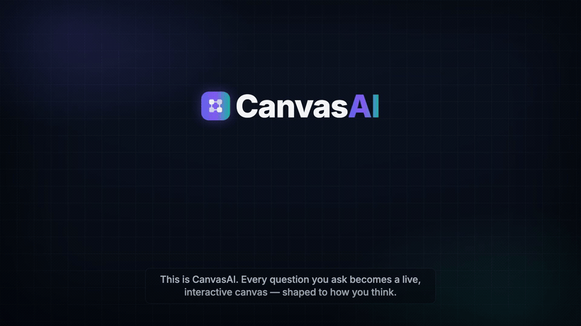
</p>

<p align="center"><sub><i>↑ A short animated intro we built (motion graphics — not a screen recording). Real screenshots of the app are <a href="#-inside-the-app-real-screenshots">further down</a>.</i></sub></p>
<!-- ===== /added ===== -->

Elite 1-on-1 visual tutoring is a luxury of the privileged. Currently, tech education is gated by a "Knowledge Wall"—hidden prerequisites and rigid curricula that overlook non-traditional learners. **CanvasAI is an intelligent, real-time visual whiteboard AI tutor built to tear that wall down.**

When a student struggles with a complex computer science concept today, they turn to famous LLMs. The problem? Those chatbots just spit back another dense wall of text. They have the knowledge, but they lack the delivery. You are forced to read paragraphs of technical jargon and *think hard* just to imagine what is actually happening. How is a novice supposed to mentally visualize the shifting memory pointers of a Linked List? Current AIs can't match the intuitive, lightbulb-moment magic of an expert teacher simply picking up a piece of chalk and drawing the concept on a blackboard.

**CanvasAI is that expert teacher, and the screen is our blackboard.** We democratize STEM education by giving every learner an infinitely patient AI tutor armed with near PhD-level domain knowledge. By decoupling pedagogy from text and mapping it to a spatial canvas, CanvasAI automatically bridges background knowledge gaps. Abstract logic becomes an interactive visual ecosystem. A student can ask the exact same question a hundred times, branch off into tangential rabbit holes, and learn at their own exact pace—completely free of judgment, ensuring no learner is ever left behind.

## 🚨 The Problem: The Inclusivity Gap
The modern tech education and upskilling pipeline is fundamentally broken for non-traditional thinkers. It relies heavily on linear, text-dense, passive reading, which disproportionately creates systemic barriers for neurodivergent individuals (ADHD, Dyslexia, Autism) and visual-spatial learners.

* **The Data:** Research reveals that 49% of neurodivergent employees feel overwhelmed by standard information density (compared to just 14% of neurotypicals). Furthermore, approximately 65% of the human population are visual learners, yet the vast majority of technical documentation and LLM outputs are rigid walls of text.
* **The Impact:** Capable individuals are overlooked, suffer from cognitive fatigue, and abandon tech pathways not because they lack the intellect, but because the traditional "delivery method" is fundamentally inaccessible to their cognitive wiring.

We don't just change the font; we change the architecture of the information.

## 🌟 Core Innovations

* **Persistent Neuroprofiles (Cognitive Accessibility):** Cognitive filters ("Spatial", "Micro-step", "Low-stim") that adapt the AI's data density, pacing, and visual UI to prevent cognitive overload. This levels the playing field by matching the tool to the brain, rather than forcing the brain to adapt to the tool.
* **The React Flow Spatial Canvas:** Visual-spatial reasoning transcends language barriers and text-processing deficits. The canvas makes the invisible (code execution, memory allocation, logic algorithms) visible, tangible, and accessible.
* **The Tireless Expert (5-Agent LangGraph Pipeline):** A fault-tolerant DAG pipeline that separates pedagogical reasoning from layout math. It guarantees a completely polished, zero-crash visual experience with an AI that never tires of explaining complex concepts.
* **ChronoSync Branchable Timelines:** A Git-style version control for cognitive states. Hover over past timeline nodes to safely branch into "what-if" scenarios. It creates a psychologically safe environment where users can ask "stupid" questions and explore without ever losing their place in the main curriculum.
* **Active Recall (SM-2):** Automates equitable long-term retention by generating flashcards natively linked to exact visual canvas states, removing the working memory burden of studying complex jargon.
* **Asynchronous Knowledge Graph:** The ultimate workforce signaling tool. Maps a learner's actual problem-solving pathways into an Inngest-powered graph database, bypassing traditional GPA metrics to show employers exactly how a candidate thinks and masters new concepts.

<!-- ===== added: screenshots, demos & architecture ===== -->

## 🖼️ Inside the App (real screenshots)

Real screens from the live app — every page works in **light and dark mode**.

**Landing page**

| Light | Dark |
|---|---|
| 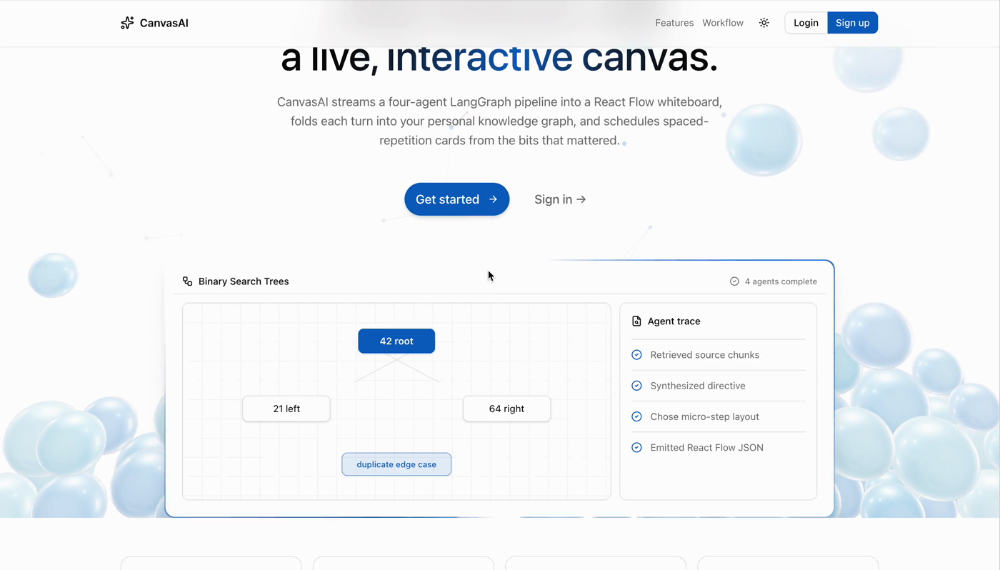 | 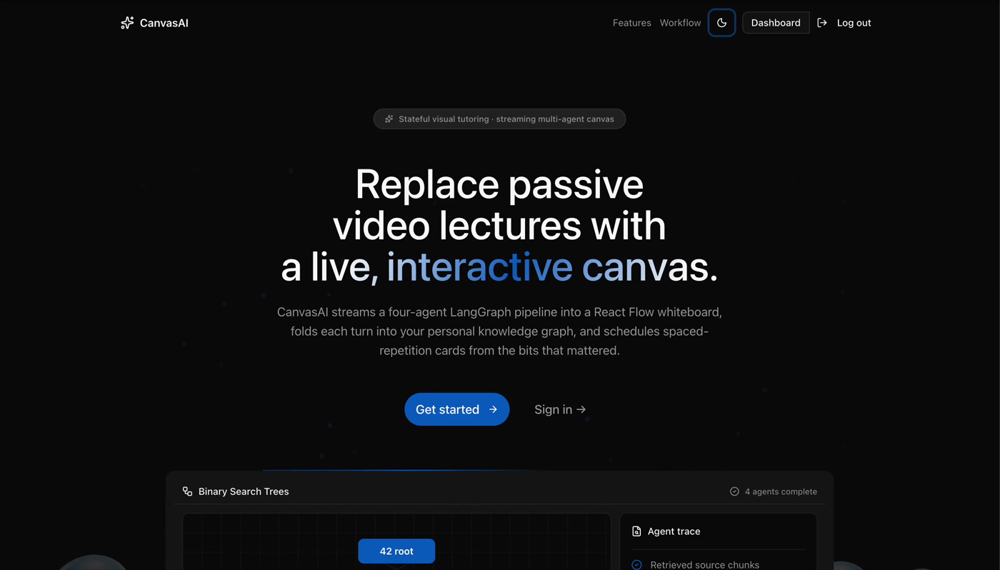 |

**The visual canvas** — your question, drawn as interactive nodes

| Light | Dark |
|---|---|
| 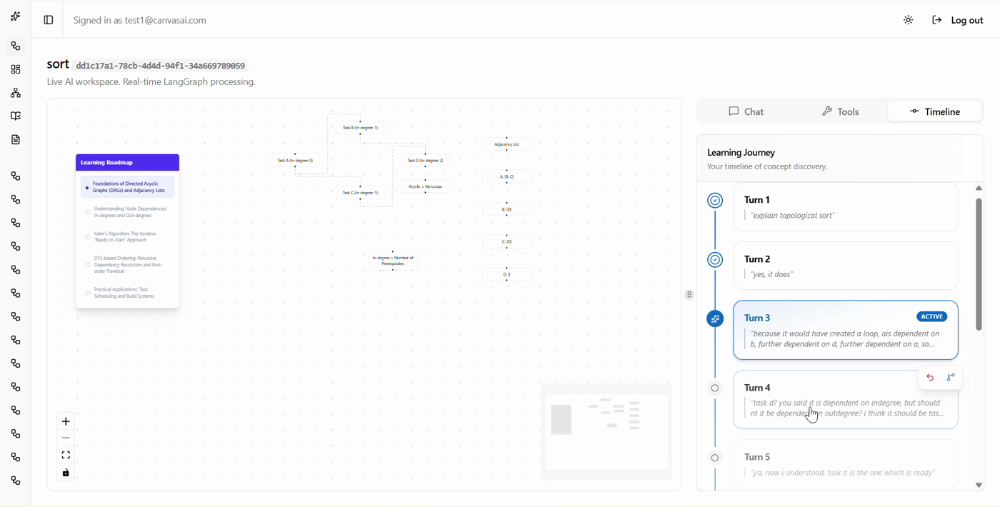 | 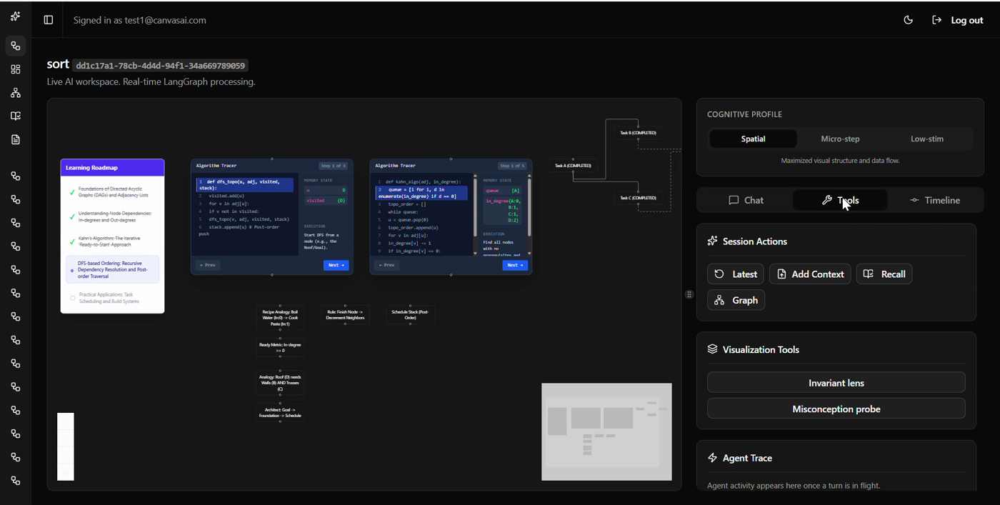 |

**Overview** — your past sessions as a spatial map

| Light | Dark |
|---|---|
| 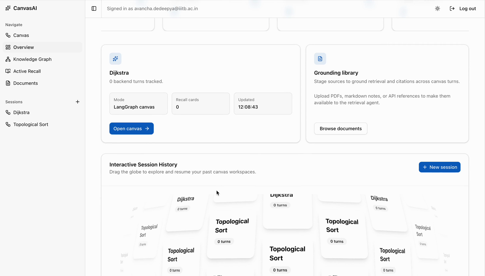 | 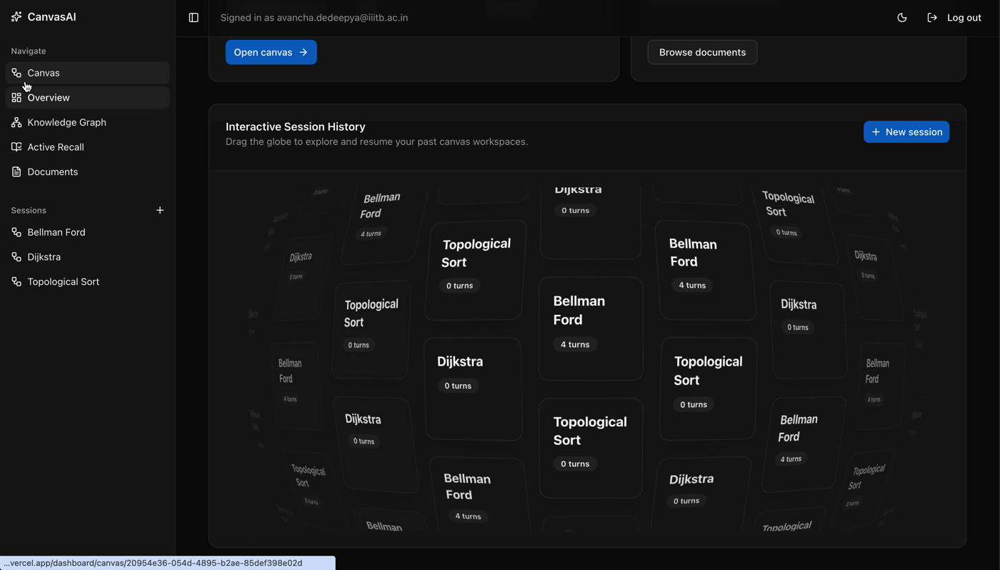 |

**Active Recall** — auto-generated SM-2 flashcards

| Light | Dark |
|---|---|
| 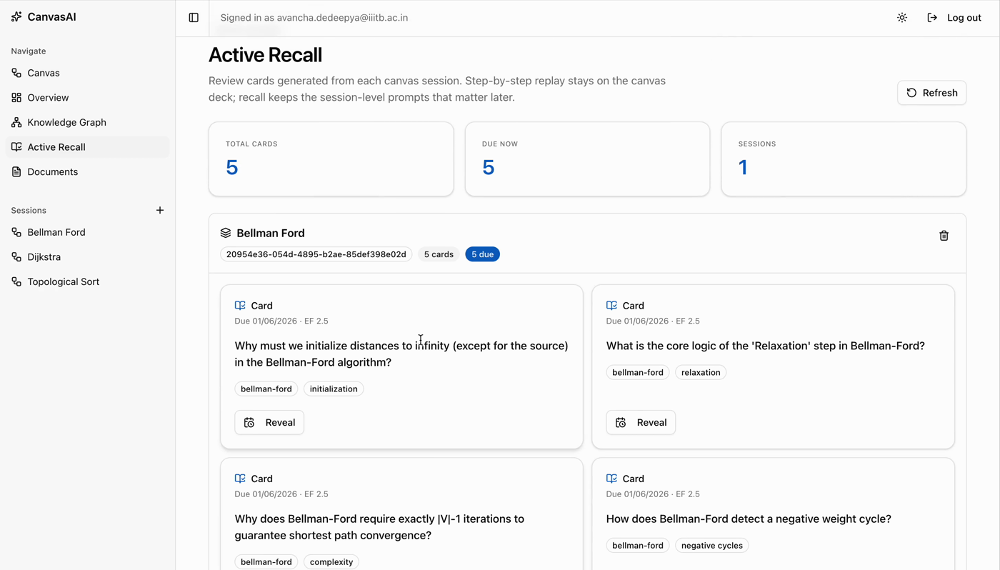 | 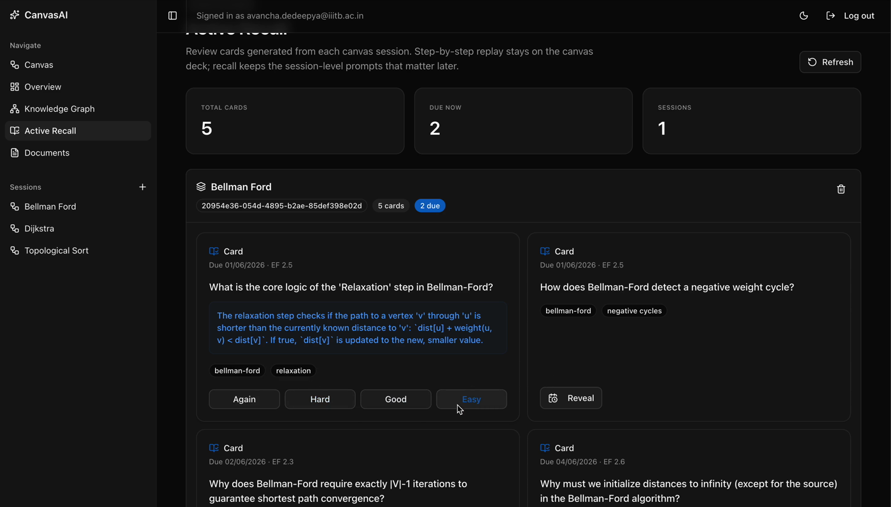 |

**Knowledge Graph** — your mastery, mapped

| Light | Dark |
|---|---|
| 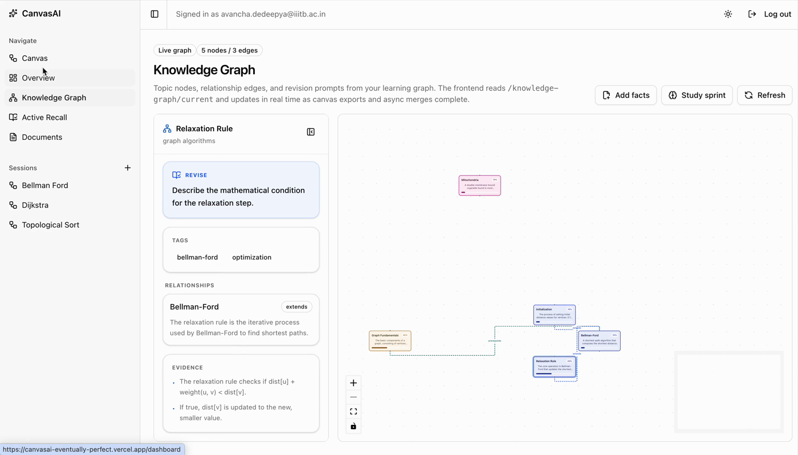 | 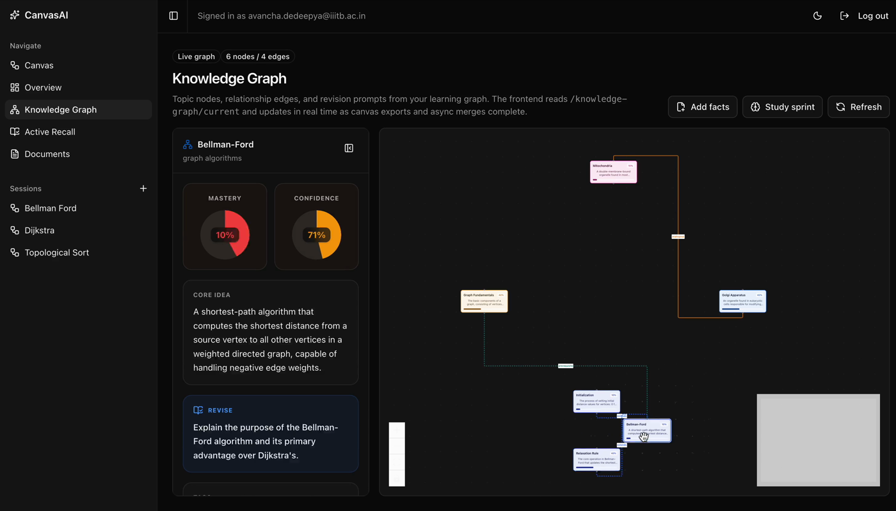 |

**ChronoSync timeline** — branch and revert any turn

<div align="center">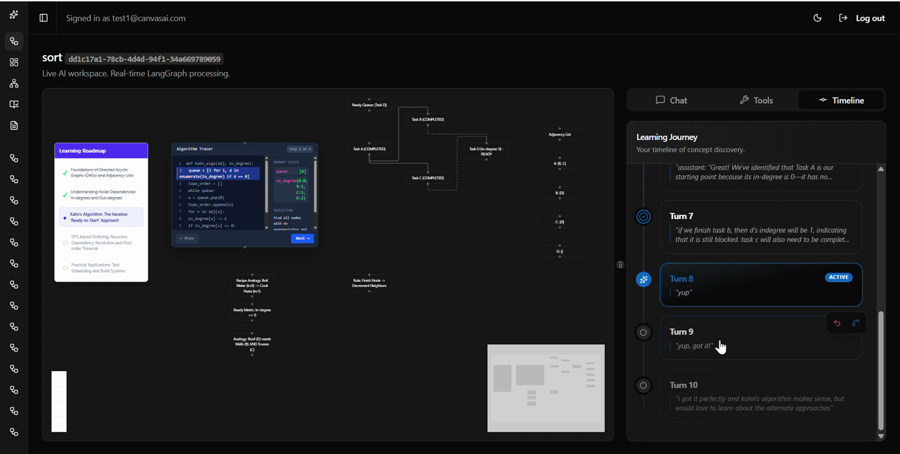</div>

**404 page** — a small playable mini-game (an inverse-kinematics snake)

| Light | Dark |
|---|---|
| 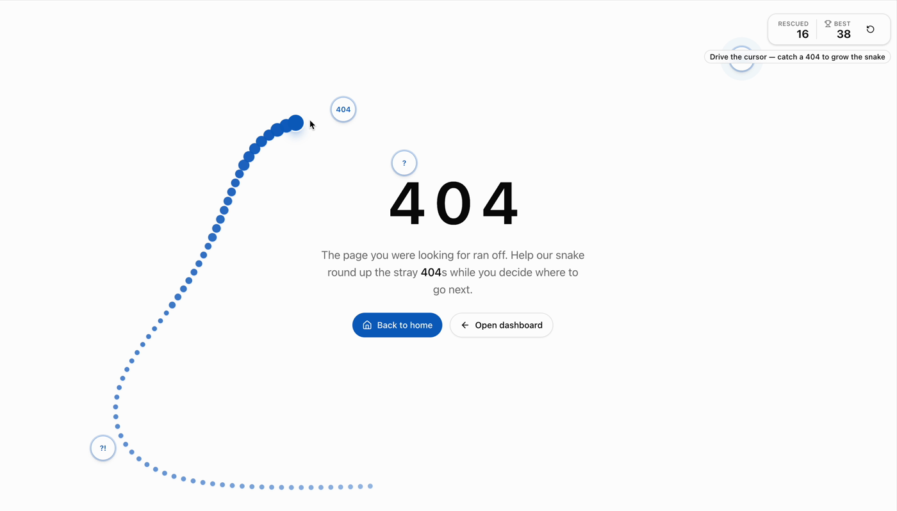 | 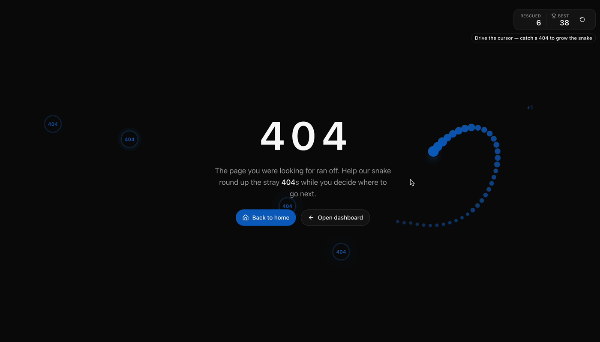 |

## 🎬 Animated Explainers (motion graphics we made)

These are short animations we built to explain the ideas. They are **not** screen recordings of the app.

**Neuroprofiles** — the same lesson, re-rendered for Spatial, Micro-step, and Low-stim

<div align="center">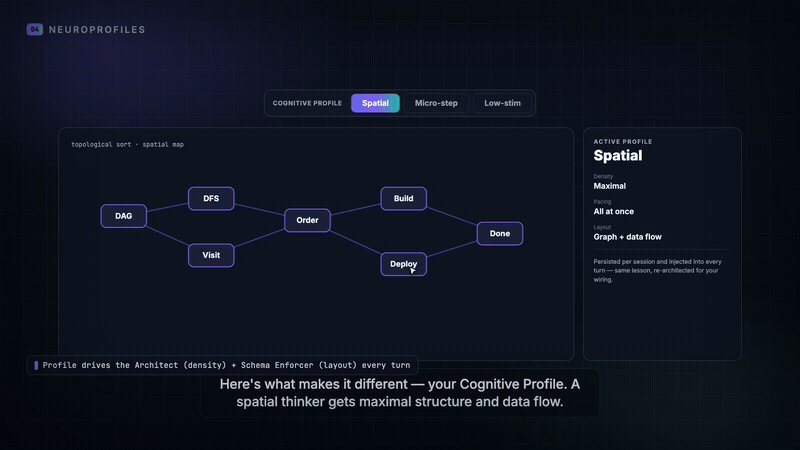</div>

**Knowledge graph** — how concepts connect and mastery is scored

<div align="center">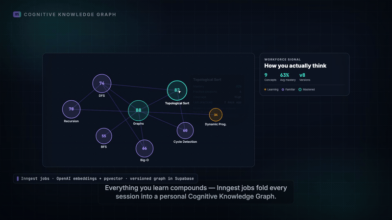</div>

## 🗺️ How It All Fits Together

One request fans out to five agents, streams a live lesson, then folds into a lasting signal — with background jobs keeping the heavy work off the critical path so the canvas never blocks.

<div align="center">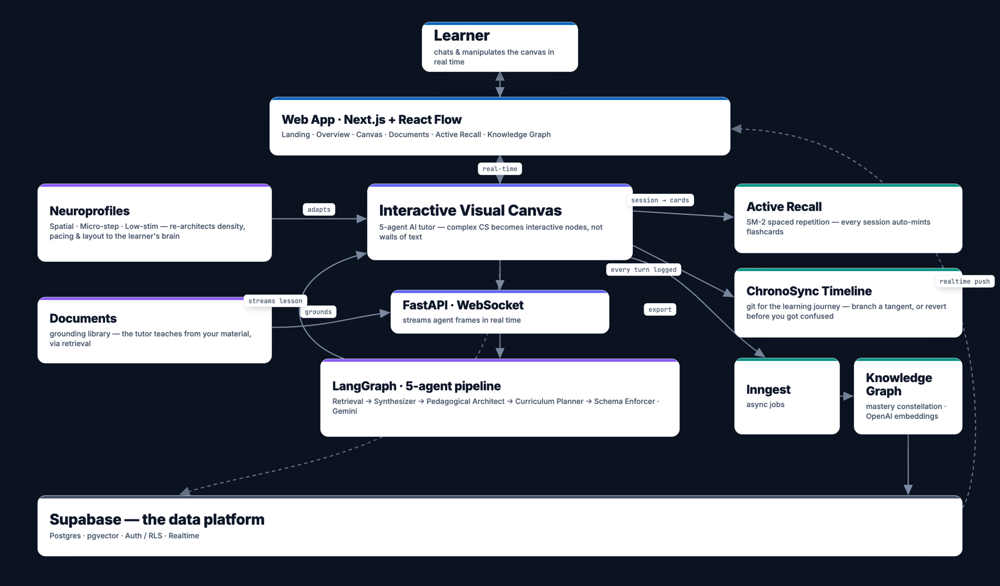</div>

The 5-agent pipeline runs in order: **Retrieval → Context Synthesizer → Pedagogical Architect → Curriculum Planner → Schema Enforcer.**

<!-- ===== /added ===== -->

## 🏗️ Tech Stack
* **Frontend:** Next.js 16 (App Router), React Flow, Tailwind CSS, Radix UI, TanStack Query (`pnpm`).
* **Backend:** FastAPI, Python, WebSockets (`uv`).
* **AI Orchestration:** LangGraph, Google Gemini 3.5-Flash (via the 3-Flash-Preview for heavy reasoning agents) & Gemini 3.1-Flash-Lite (for fast, lightweight agents), Strict Pydantic Outputs.
* **Infrastructure:** Inngest (Event-driven jobs), Supabase (PostgreSQL, Auth, RLS).

## 🚀 Quick Start (Local Development)

### 1. Start the Backend (`uv`)
```bash
cd backend
cp .env.example .env
uv sync
uv run uvicorn canvasai.main:app --reload --port 8000
```

### 2. Start the Frontend (`pnpm`)

```bash
cd frontend
pnpm install
pnpm dev
```

### 3. Start Inngest (For Knowledge Graph workers)

```bash
npx inngest-cli@latest dev
```

---

## 📖 Deep Dives & Documentation
Want to look under the hood? Check out our detailed technical specs:

* **[Architecture & System Design](docs/architecture.md)** — Detailed multi-agent DAG pipeline and frontend hydration strategy.
* **[Feature Specifications](docs/features.md)** — The complete rationale, problems solved, and mechanics behind our core innovations.
* **[Knowledge Graph Mechanics](docs/knowledge-graph.md)** — Deep dive into the extraction, merging, and scoring algorithms behind our workforce signaling tool.

---
