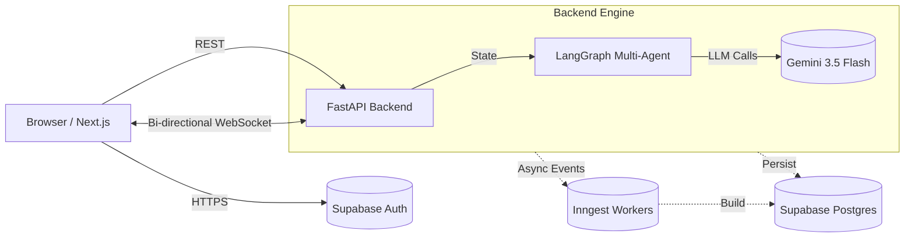
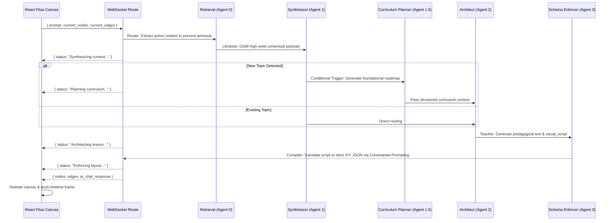

# CanvasAI System Architecture 

CanvasAI decouples "teaching" from "layout rendering" to guarantee stable, visual-first UI components.

## 1. System Overview

## 2. The 5-Agent LangGraph Pipeline (DAG)

Standard LLMs fail at visual education because they attempt to reason about pedagogy and compute strict JSON coordinate math simultaneously. We solve this via a specialized pipeline:

## 3. Frontend Hydration & Session Caching

To ensure instantaneous loading without SSR blocking, the frontend uses a highly aggressive TanStack Query cache (`frontend/lib/session-cache.ts`):

* **Stale-while-revalidate:** Serves cached canvas payloads instantly while re-fetching background updates.
* **Hover Prefetching:** Hovering over a session row in the sidebar pre-warms the cache before the user clicks, resulting in zero network-latency transitions.
* **Timeline Branching:** When a user forks a timeline, the new session's cache is warmed dynamically before routing to ensure the destination canvas paints immediately.
