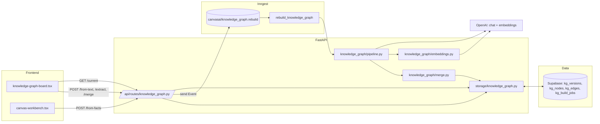
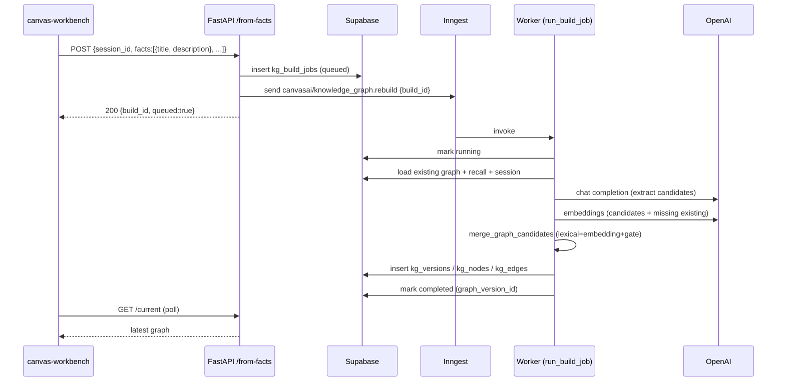
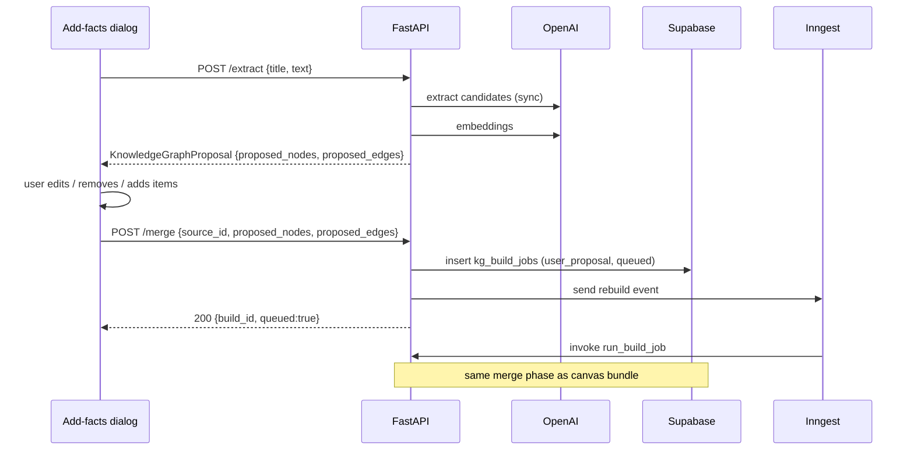

# Knowledge Graph

End-to-end design for the user knowledge graph: how facts move from the canvas
(or a manual entry box) into a versioned graph in Supabase, and how nodes/edges
are deduplicated and merged.

## High-level architecture



## Storage schema (Supabase)

Tables live in [`backend/sql/knowledge_graph.sql`](../backend/sql/knowledge_graph.sql).
The graph is **versioned**: every successful build appends a new
`kg_versions` row plus its `kg_nodes` / `kg_edges`. Reads always serve
the latest version. Older versions stay around for history/rollback.

| Table             | Purpose                                                    |
| ----------------- | ---------------------------------------------------------- |
| `kg_versions`     | One row per graph snapshot (per user, monotonically versioned). |
| `kg_nodes`        | Topic nodes, scoped by `(graph_version_id, id)`. Stores `embedding vector(1536)` after applying [`knowledge_graph_embeddings.sql`](../backend/sql/knowledge_graph_embeddings.sql). |
| `kg_edges`        | Typed relations between nodes; FKs cascade from `kg_nodes`. |
| `kg_build_jobs`   | Async job tracking. `source_type ∈ {session_export, manual_facts, user_proposal}` (apply [`knowledge_graph_user_proposal.sql`](../backend/sql/knowledge_graph_user_proposal.sql) for the new variant). |

RLS pins every row to `user_id = auth.uid()` for the public client; the
Inngest worker writes via the service-role client.

## Endpoints

| Method | Path                                  | Sync? | Used by                   |
| ------ | ------------------------------------- | ----- | ------------------------- |
| GET    | `/knowledge-graph/current`            | sync  | Frontend graph board.     |
| POST   | `/knowledge-graph/from-session/{id}`  | async | Workbench "Graph" button. |
| POST   | `/knowledge-graph/from-text`          | async | Manual one-shot (legacy). |
| POST   | `/knowledge-graph/extract`            | sync  | Manual review flow, step 1. |
| POST   | `/knowledge-graph/merge`              | async | Manual review flow, step 2. |
| POST   | `/knowledge-graph/from-facts`         | async | **Canvas → KG layer 1 (teammate's path).** |

## Canvas → KG payload (`POST /knowledge-graph/from-facts`)

Use this when the canvas turn produces a bundle of `{title, description}`
facts. The endpoint enqueues an Inngest job and runs the same extraction
+ merge pipeline as the manual flow — the LLM rewrites titles/summaries,
adds edges between bundled facts, and links them to existing graph nodes.
**No user review step**; the merged result is committed directly. Send
the user's Supabase access token in `Authorization: Bearer <token>`.

```json
POST /knowledge-graph/from-facts
Content-Type: application/json
Authorization: Bearer <supabase-access-token>

{
  "session_id": "9f5b3c2e-...",         // optional uuid; null for ad-hoc bundles
  "facts": [
    {
      "title": "Hash table",
      "description": "Key-value store with O(1) average-case lookup using a hash function..."
    },
    {
      "title": "Bloom filter",
      "description": "Probabilistic set membership..."
    }
  ]
}
```

Response (immediate, before the merge runs):

```json
{
  "graph_id": "kg_<user_id>",
  "build_id": "b9f2...",
  "queued": true,
  "message": "Queued 2 canvas facts for graph merge."
}
```

The merged graph appears on `GET /knowledge-graph/current` once Inngest
finishes the job (typically a few seconds). The frontend graph board
polls every 15s, so updates surface automatically.

### What the pipeline does with a bundle

1. **Extraction** — each fact becomes a candidate node (title → title,
   description → summary). The LLM extraction prompt sees the whole
   bundle plus the user's existing graph and proposes:
   - title/summary rewrites (typos, terse fragments, missing context),
   - additional nodes for important entities mentioned in descriptions,
   - edges between bundle facts and to existing graph nodes.
2. **Embeddings** — every candidate and existing node missing an
   embedding gets one via OpenAI `text-embedding-3-small`.
3. **Merge** — see the Merge algorithm section below.
4. **Persist** — a new `kg_versions` row + its nodes/edges. The build
   job row records `completed` with the new `graph_version_id`.

## Merge algorithm

Implemented in [`merge.py`](../backend/src/canvasai/knowledge_graph/merge.py).

**Node phase**

For each candidate node:

1. Exact alias match in the existing graph (`normalize_topic_key` keys).
2. Otherwise compute `score = max(lexical_similarity, scaled_embedding_cosine)`
   against every existing node:
   - `score ≥ 0.86` → merge in (preserves id, position, history).
   - `0.60 ≤ score < 0.86` → ask the LLM "are these the same concept?"
     and merge only on a confident yes.
   - else → mint a new node, id = `normalize_topic_key(title)` (with
     `-2`, `-3` suffixes on collision).

Merging unions tags, evidence, aliases, and source sessions; confidence
is averaged; the freshest summary/embedding wins.

**Edge phase**

For each candidate edge (`source_title`, `target_title`, `relation`):

1. Resolve each endpoint title via `_resolve_or_create_node`:
   - direct hit in the candidate-title-to-id map (handles new ↔ new edges),
   - alias index of final nodes (handles new ↔ existing and existing ↔ existing),
   - fuzzy lexical match at `≥0.72` (catches "Consumer Groups" → existing "Kafka Consumer Group"),
   - else **mint a placeholder node** with that title (was silently dropped pre-fix).
2. Drop self-loops.
3. Canonicalize endpoints for symmetric relations (`analogous`, `contrasts`)
   so reversed duplicates collapse.
4. `edge_key = (source_id, target_id, relation)`. If exists, merge
   strengths (max), concatenate evidence, union sessions. Otherwise
   append new with id = `normalize_topic_key("{source}-{relation}-{target}")`.

Edge ids are deterministic so re-running the same bundle is idempotent.

## Sequence: canvas bundle (no review)



## Sequence: manual review flow



## Local dev

```bash
./scripts/run_knowledge_graph_dev.sh   # boots backend + Inngest dev + frontend
./scripts/stop_knowledge_graph_dev.sh  # tears them down
```

Inngest dev server: http://localhost:8288 (event log, function runs, retries).
Frontend KG board: http://localhost:3000/dashboard/knowledge.

### Required SQL (run in Supabase SQL editor in order)

1. [`backend/sql/knowledge_graph.sql`](../backend/sql/knowledge_graph.sql) — base tables + RLS.
2. [`backend/sql/knowledge_graph_embeddings.sql`](../backend/sql/knowledge_graph_embeddings.sql) — pgvector + embedding column. Enable the `vector` extension first (Dashboard → Database → Extensions).
3. [`backend/sql/knowledge_graph_user_proposal.sql`](../backend/sql/knowledge_graph_user_proposal.sql) — adds `user_proposal` to the `source_type` check.

### Required env vars

| Var                            | Used for                                  |
| ------------------------------ | ----------------------------------------- |
| `SUPABASE_URL`, `SUPABASE_SERVICE_ROLE_KEY` | Admin writes from Inngest worker.   |
| `SUPABASE_ANON_KEY`            | User-scoped reads.                        |
| `OPENAI_API_KEY`               | Extraction LLM + embeddings (degrades gracefully if absent). |
| `INNGEST_APP_ID` (default `canvasai`) | Inngest registration.              |
| `INNGEST_EVENT_KEY`, `INNGEST_SIGNING_KEY` | Empty for local dev (uses Inngest dev server). |

## Troubleshooting

- **No edges in the graph** — check backend logs for `kg.merge: skipping
  edge` and `kg.extract: parsed N nodes and M edges`. If `M=0`, the LLM
  isn't returning edges; check the OpenAI key isn't a stub
  (`OPENAI_API_KEY` configured, model not 401'd).
- **Edges land on placeholder nodes** — the LLM produced an edge
  endpoint that didn't match any candidate or existing node. Either
  edit the title in the manual review flow before merging, or improve
  the descriptions you send so the LLM uses canonical names.
- **Embeddings missing** — `kg.embeddings: request failed` in logs.
  Pipeline still works, falls back to lexical similarity only.
- **Inngest event never fires the function** — make sure the dev server
  is running and pointed at `http://127.0.0.1:8000/api/inngest`. The
  `run_knowledge_graph_dev.sh` script wires that up.
- **`kg_build_jobs.status = failed`** — `error` column has the stack.
  `backend/scripts/run_queued_knowledge_graph_jobs.py` can re-run any
  queued jobs synchronously without Inngest.
