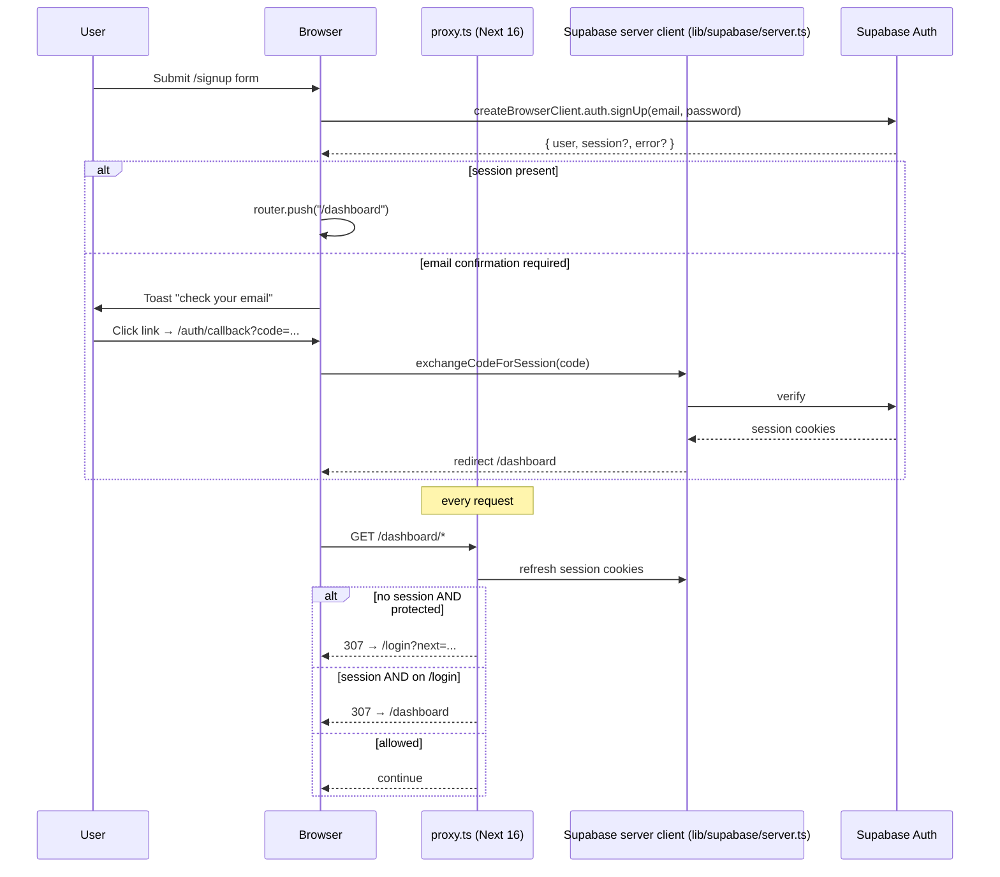
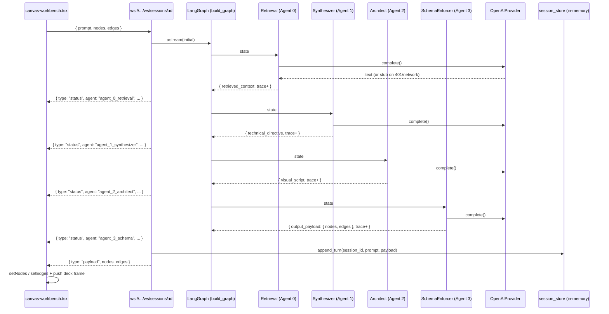
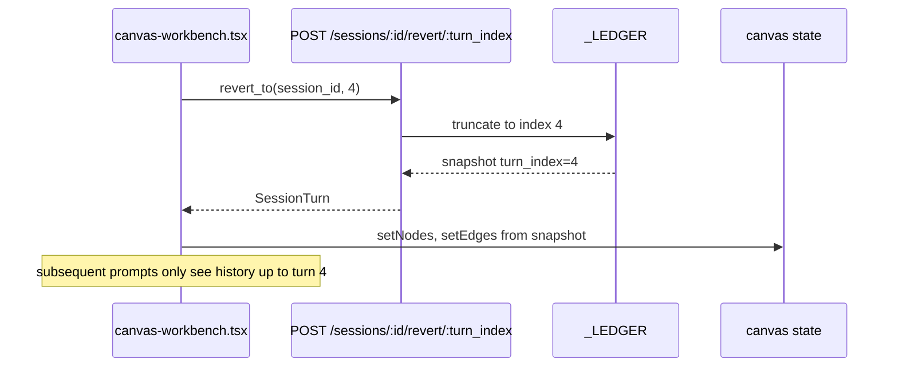

# Architecture

All diagrams are mermaid.

## 1. System overview

```mermaid
flowchart LR
  Browser[Browser] -->|HTTPS| Next[Next.js 16 App Router]
  Next -->|@supabase/ssr| SupaAuth[(Supabase Auth)]
  Next -->|fetch /sessions, /chat, /active-recall| FastAPI[FastAPI app]
  Next -->|WebSocket /ws/sessions/:id| FastAPI
  FastAPI -->|LangGraph chain| Agents[4-agent pipeline]
  Agents -->|LLMProvider.complete| OpenAI[(OpenAI Chat)]
  Agents -.future RAG.-> PgVector[(Supabase pgvector)]
  FastAPI -.future persistence.-> Postgres[(Supabase Postgres)]
  Inngest[(Inngest workflows)] -.future jobs.-> FastAPI
```

Solid arrows = wired today. Dashed = planned, not yet implemented.

## 2. Auth flow (Supabase, cookie-based)



## 3. Canvas turn (live WebSocket)



If anything in the pipeline raises, [`ws.py`](../backend/src/canvasai/api/routes/ws.py) sends `{ type: "error", message }` and stays connected so the UI can retry.

## 4. Active-recall card lifecycle

```mermaid
flowchart TD
  Canvas[Canvas → "Add recall" button] -->|POST /active-recall/from-session/:id| Build[active_recall.replace_for_session]
  Build -->|LLM JSON drafts or fallback_drafts| Cards[(_CARDS dict)]
  Cards -->|GET /active-recall/sessions| Recall[Recall page]
  Recall -->|POST /cards/:id/review { rating }| SM2[SM-2 review]
  SM2 -->|update ease_factor, repetitions, interval, due_at| Cards
  SM2 -->|new due_at| Recall
  Recall -->|DELETE /sessions/:id| Cards
```

SM-2 lives in [`storage/active_recall.py:review()`](../backend/src/canvasai/storage/active_recall.py). Cards die on uvicorn restart; persistence plan in [feature-active-recall.md](feature-active-recall.md).

## 5. Time machine (planned, currently in-memory)



This is the contract; the frontend doesn't actually call it from a UI button yet — only deck-replay navigation works visually. See [feature-canvas.md](feature-canvas.md).

## 6. Knowledge graph (mock today, real tomorrow)

```mermaid
flowchart LR
  subgraph Today
    KGPage[Knowledge graph page] -->|GET /knowledge-graph/current| FE_Mock[mock-knowledge-graph.ts fallback]
    Canvas[Canvas → "Export graph"] -->|POST /knowledge-graph/from-session/:id| Toast[Toast: not wired]
  end

  subgraph Planned
    KGPage2[Knowledge graph page] -->|GET| KGAPI[/knowledge-graph/current/]
    Canvas2[Canvas → Export graph] -->|POST| Job[Knowledge graph extractor job]
    Job --> Extract[Extract topics + relations via LLM]
    Extract --> Merge[Canonicalize + dedupe]
    Merge --> Score[Score mastery, confidence, strength]
    Score --> Algo[Graph algos: communities, centrality, link prediction]
    Algo --> Persist[(graph_versions, kg_nodes, kg_edges, evidence)]
    Persist --> KGAPI
    Persist --> Notify[Notify FE: WS / SSE / poll]
    Notify --> KGPage2
  end
```

Algorithm references and tradeoffs live in [kd.md](kd.md).

## 7. Folder layout (working memory map)

```
CanvasAI/
├── CONTEXT.md                  ← read first
├── todo/                       ← you are here
├── ref_project/                ← reference Next.js project to learn from (ignored by git)
├── frontend/
│   ├── app/                    ← App router routes
│   ├── components/
│   │   ├── ui/                 ← shadcn primitives — auto-generated
│   │   ├── blocks/             ← Tailark-style composed blocks (header, footer, sidebar, hero, ...)
│   │   ├── auth/               ← logout-button (forms moved to components/forms)
│   │   ├── forms/              ← login-form, signup-form (RHF + zod + shadcn Form)
│   │   ├── theme/              ← provider, toggle
│   │   ├── canvas/             ← Canvas + workbench
│   │   ├── chat/               ← chat-playground
│   │   ├── recall/             ← active-recall-board
│   │   ├── knowledge/          ← knowledge-graph-board
│   │   ├── documents/          ← document-library
│   │   └── dashboard/          ← dashboard-home-client + new-session-dialog
│   ├── lib/
│   │   ├── canvasai-api.ts     ← typed fetch client
│   │   ├── canvasai-types.ts   ← shared types
│   │   ├── mock-data.ts        ← canvas/document seed data
│   │   ├── mock-knowledge-graph.ts
│   │   └── supabase/           ← client / server / proxy session helpers
│   └── proxy.ts                ← Next 16 renamed middleware
└── backend/
    └── src/canvasai/
        ├── main.py             ← FastAPI factory
        ├── config.py           ← pydantic settings
        ├── schemas.py          ← all pydantic request/response models
        ├── api/routes/         ← health, sessions, chat, active_recall, documents, ws
        ├── agents/             ← base + 4 agents (one per file)
        ├── graph/              ← state.py + builder.py
        ├── llm/                ← provider.py + openai_provider.py
        ├── storage/            ← in-memory stores (sessions, chat, active_recall, documents, supabase_client)
        └── inngest_app/        ← functions.py (one no-op ping)
```
