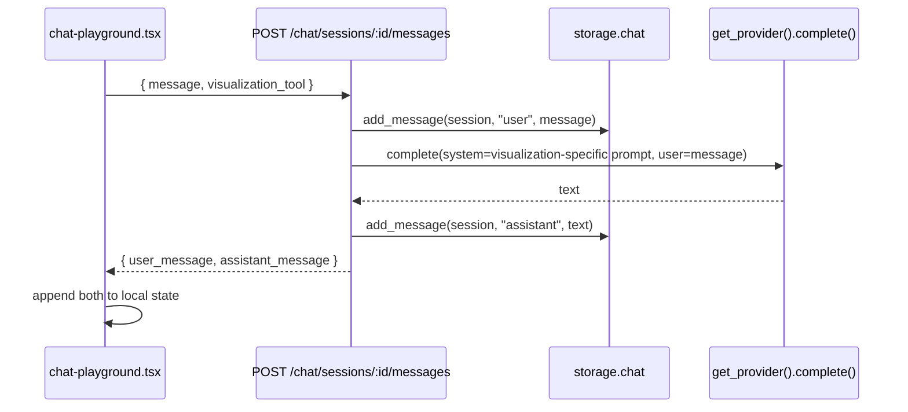

# Feature — Standalone Learning Chat

## What works ✅

- Routes:
  - `POST /chat/sessions` — creates a chat session.
  - `GET /chat/sessions` — lists sessions, newest first.
  - `GET /chat/sessions/{id}/messages` — full transcript.
  - `POST /chat/sessions/{id}/messages` — append a user message, get an assistant reply via the LLM provider, returns both.
- Visualization tools: `socratic | analogy | steps | diagram` are accepted and forwarded to the LLM as part of the system prompt.
- Frontend page: [`/dashboard/chat`](../frontend/app/dashboard/chat/page.tsx) using [`chat-playground.tsx`](../frontend/components/chat/chat-playground.tsx).

## What's mocked 🟡

- `_SESSIONS` dict in [`storage/chat.py`](../backend/src/canvasai/storage/chat.py).
- Title auto-set to the first 48 chars of the first user message — no rename UI yet.

## What's missing 🔴

- Persistence + per-user scoping.
- Streaming responses (currently single-shot HTTP, not WS or SSE).
- Conversation summarization for long threads (will hit context limits).
- No connection between chat messages and canvas sessions — they are independent.

## Flow



## DB plan

```sql
create table public.chat_sessions (
  id uuid primary key default gen_random_uuid(),
  user_id uuid not null references auth.users(id) on delete cascade,
  title text not null,
  created_at timestamptz not null default now(),
  updated_at timestamptz not null default now()
);

create table public.chat_messages (
  id uuid primary key default gen_random_uuid(),
  session_id uuid not null references public.chat_sessions(id) on delete cascade,
  role text not null check (role in ('user','assistant','system')),
  content text not null,
  created_at timestamptz not null default now()
);

create index chat_messages_session_idx on public.chat_messages(session_id, created_at);
```

RLS scoped to `user_id`, same pattern as canvas sessions.

## TODO checklist

- [ ] Apply SQL + RLS.
- [ ] Swap `_SESSIONS` in [`storage/chat.py`](../backend/src/canvasai/storage/chat.py) for Supabase queries.
- [ ] Convert message endpoint to streaming (SSE or WebSocket) so the assistant reply renders character-by-character — matches the canvas WS UX.
- [ ] Add a summarizer pass when a session crosses N tokens; store summary on `chat_sessions.summary` and reset the active context.
- [ ] (Optional) Add a chat-to-canvas action: "Open this in a canvas session" that creates a `canvas_sessions` row seeded with the assistant's last suggestion.
