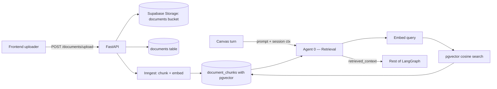

# Feature — Documents (Visual RAG sources)

This is the most stubbed feature. The frontend has a polished library UI; the backend is a placeholder.

## What works ✅

- Frontend library UI at [`/dashboard/documents`](../frontend/app/dashboard/documents/page.tsx) with mock document list, status badges, tags, and search affordances.
- Endpoint exists: `POST /documents/upload` accepts a multipart file.

## What's mocked 🟡

- The mock library shows three demo PDFs/notes/docs from [`mock-data.ts:DEMO_DOCUMENTS`](../frontend/lib/mock-data.ts#L9-L40).
- The retrieval agent ([`agents/retrieval_agent.py`](../backend/src/canvasai/agents/retrieval_agent.py)) returns `retrieved_context: []` so RAG never grounds anything.

## What's missing 🔴 (basically everything)

- Storage: file bytes are read in the route ([`routes/documents.py`](../backend/src/canvasai/api/routes/documents.py)) but [`storage/documents.py:upload`](../backend/src/canvasai/storage/documents.py) returns `{stored: false}`. No bucket. No DB row.
- Chunking, embeddings, pgvector index.
- Search: `storage/documents.py:search` returns `[]`.
- A `GET /documents` endpoint to list real documents (frontend uses mock data only).
- Document → session linkage (which sources grounded which turn).
- Per-user scoping.

## Target architecture



## DB plan

```sql
-- enable pgvector once
create extension if not exists vector;

create table public.documents (
  id uuid primary key default gen_random_uuid(),
  user_id uuid not null references auth.users(id) on delete cascade,
  title text not null,
  storage_path text not null,        -- 'user-uid/filename.pdf' in 'documents' bucket
  mime_type text,
  size_bytes bigint,
  status text not null default 'queued' check (status in ('queued','indexing','indexed','failed')),
  chunk_count int not null default 0,
  tags text[] not null default '{}',
  created_at timestamptz not null default now(),
  updated_at timestamptz not null default now()
);

create table public.document_chunks (
  id uuid primary key default gen_random_uuid(),
  document_id uuid not null references public.documents(id) on delete cascade,
  chunk_index int not null,
  content text not null,
  -- 1536 = text-embedding-3-small / ada-002. Switch to 3072 for text-embedding-3-large.
  embedding vector(1536),
  created_at timestamptz not null default now(),
  unique (document_id, chunk_index)
);

-- HNSW or IVFFlat index for similarity search
create index document_chunks_embedding_idx
  on public.document_chunks
  using hnsw (embedding vector_cosine_ops);
```

RLS:
```sql
alter table public.documents enable row level security;
alter table public.document_chunks enable row level security;
create policy "owner crud documents" on public.documents
  for all using (user_id = auth.uid()) with check (user_id = auth.uid());
create policy "owner read chunks" on public.document_chunks
  for select using (
    exists (select 1 from public.documents d where d.id = document_id and d.user_id = auth.uid())
  );
```

Storage bucket: create a `documents` bucket in Supabase Studio with RLS policy "user can read/write within `user-uid/` prefix".

## Implementation sequence

1. Storage bucket + tables + RLS.
2. Wire upload: route → upload bytes to bucket at `{user_id}/{uuid}-{filename}` → insert row in `documents` with `status='queued'`.
3. Trigger Inngest event `documents/uploaded`. Worker: download bytes, parse (pdfplumber for PDF, plain text for `.md`/`.txt`), chunk to ~800 tokens with overlap, embed via the LLM provider's `embed()` (new method on the protocol — see step 4), upsert into `document_chunks`, set `status='indexed'`.
4. Add `embed(texts: list[str]) -> list[list[float]]` to the `LLMProvider` Protocol; implement in `OpenAIProvider` (calls `https://api.openai.com/v1/embeddings`). Same graceful-degrade pattern as `complete()`.
5. Implement `storage/documents.py:search(query, k)`: embed the query, run `select ... order by embedding <=> $1 limit k` against `document_chunks` joined to `documents` (filtered by `auth.uid()`).
6. Update [`agents/retrieval_agent.py`](../backend/src/canvasai/agents/retrieval_agent.py) to call `documents.search(state["prompt"], k=4)` and feed results into `retrieved_context`.
7. Add `GET /documents` listing for the library page; replace the mock list with the API result.
8. Track which chunks grounded each canvas turn — store `chunk_ids: uuid[]` on `canvas_turns`. Powers "Why did the AI say this?" tooltips later.

## Caching ideas (per-user)

- Cache `(user_id, query_hash) -> chunk_ids[]` in Redis or a `query_cache` table for 5 minutes. The retrieval agent runs on every turn; if the prompt didn't change much, reuse.
- Cache embeddings: hash chunk content; if it already exists in `document_chunks` for this user, reuse the embedding instead of re-embedding.

## TODO checklist

- [ ] Create the `documents` storage bucket in Supabase Studio with `{user_id}/*` RLS.
- [ ] Apply DB schema + RLS.
- [ ] Add `embed()` to the LLM provider protocol + OpenAI implementation.
- [ ] Implement `storage/documents.py:upload` (write to bucket + insert row + enqueue Inngest).
- [ ] Add Inngest worker for chunking + embedding.
- [ ] Implement `storage/documents.py:search`.
- [ ] Wire `RetrievalAgent` to `search()`.
- [ ] Add `GET /documents` route + replace `DEMO_DOCUMENTS` in the library UI with API data.
- [ ] (Stretch) FAISS comparison benchmark vs pgvector for the spec's "evaluating indexing techniques" bullet.
