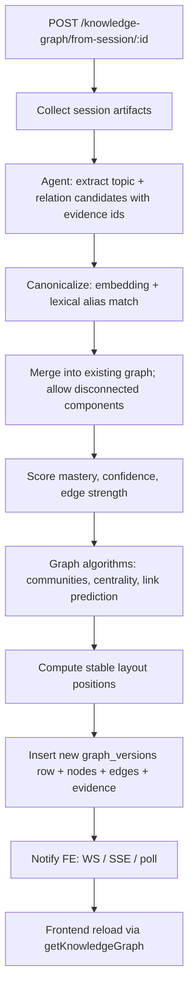

# Feature — Knowledge Graph

The deep design notes (algorithm choices, Neo4j vs Postgres, references) are in [kd.md](kd.md). This file is the *current state* and *what to build next*.

## What works ✅

- Page at [`/dashboard/knowledge`](../frontend/app/dashboard/knowledge/page.tsx) using [`knowledge-graph-board.tsx`](../frontend/components/knowledge/knowledge-graph-board.tsx).
- Mock graph payload with topics, edges, evidence, mastery, confidence, clusters in [`mock-knowledge-graph.ts`](../frontend/lib/mock-knowledge-graph.ts).
- Left revision drawer: clicking a topic opens summary, revision prompt, tags, evidence, connected relationships.
- Adaptive Study Sprint modal: turns the graph into three actions (retrieval practice on weakest topic, prerequisite repair, interleaving with another cluster).
- Frontend API seam: [`getKnowledgeGraph()`](../frontend/lib/canvasai-api.ts) calls `GET /knowledge-graph/current` and falls back to the mock when the call fails.
- Canvas "Export graph" button: calls `POST /knowledge-graph/from-session/{id}` and toasts the response (or "endpoint not wired" if missing).

## What's missing 🔴

- Both backend endpoints (`GET /knowledge-graph/current`, `POST /knowledge-graph/from-session/{id}`).
- The extractor/merger/scorer pipeline (designed in [kd.md](kd.md)).
- Storage tables.
- Update notifications to the frontend.

## Frontend contract

The canonical type is in [`canvasai-types.ts`](../frontend/lib/canvasai-types.ts) (`KnowledgeGraphPayload`). Backend MUST match this when implementing `GET /knowledge-graph/current`. See [kd.md](kd.md) for the full TypeScript shape.

## Pipeline (from [kd.md](kd.md), summarized)



## DB plan (Postgres-first; revisit if graph algorithms become hot path)

```sql
create table public.kg_versions (
  id uuid primary key default gen_random_uuid(),
  user_id uuid not null references auth.users(id) on delete cascade,
  version int not null,
  generated_at timestamptz not null default now(),
  source_summary jsonb not null,                     -- {sessions, documents, cards}
  update_plan jsonb not null,                        -- {trigger, algorithm, notes}
  unique (user_id, version)
);

create table public.kg_nodes (
  id text primary key,                               -- stable id; canonicalized topic key
  graph_version_id uuid not null references public.kg_versions(id) on delete cascade,
  user_id uuid not null references auth.users(id) on delete cascade,
  title text not null,
  summary text not null,
  revision_prompt text not null,
  mastery numeric(3,2) not null,                     -- 0..1
  confidence numeric(3,2) not null,                  -- 0..1
  cluster text not null,
  tags text[] not null default '{}',
  evidence text[] not null default '{}',             -- chunk ids, card ids, etc
  source_session_ids uuid[] not null default '{}',
  position jsonb not null                            -- {x, y}
);

create table public.kg_edges (
  id text primary key,
  graph_version_id uuid not null references public.kg_versions(id) on delete cascade,
  source text not null,
  target text not null,
  relation text not null check (relation in ('prerequisite','extends','analogous','contrasts','debugs')),
  strength numeric(3,2) not null,
  evidence text not null,
  source_session_ids uuid[] not null default '{}'
);
```

Strategy: **append a new `kg_versions` row each time, then bulk-insert `kg_nodes`/`kg_edges` for that version.** Reads always join to the latest version per user. Old versions are kept for auditability. (Or prune anything older than 30 days via Inngest cron.)

If graph algorithms become the product (centrality computed on every interaction, complex traversals), revisit Neo4j; today it's overkill.

## Notification options when a new version lands

| Option | Latency | Complexity | Verdict |
|---|---|---|---|
| Frontend polls `GET /knowledge-graph/current` every 10s | 10s | Trivial | Hackathon default |
| Backend returns `{queued: true}` and frontend re-polls on demand | seconds | Easy | Better UX |
| Supabase Realtime subscription on `kg_versions` | instant | Adds dep | Best UX, after persistence lands |
| Custom WS/SSE channel | instant | Most code | Skip unless you already have a WS hub |

## TODO checklist

- [ ] Apply DB schema + RLS (RLS scopes everything by `user_id`).
- [ ] Add `GET /knowledge-graph/current` route — read latest `kg_versions` for the user, join nodes/edges, return `KnowledgeGraphPayload`.
- [ ] Add `POST /knowledge-graph/from-session/{id}` route — enqueue an Inngest event with `{user_id, session_id}`.
- [ ] Inngest worker that runs the extraction → merge → score → persist pipeline (see [kd.md](kd.md) for algorithm choices and references).
- [ ] Replace `mock-knowledge-graph.ts` with real data once the API stops 404'ing. Keep the file as a typed example — it documents the contract.
- [ ] Add Realtime (or polling) refresh in [`knowledge-graph-board.tsx`](../frontend/components/knowledge/knowledge-graph-board.tsx).
- [ ] Wire `evidence` clicks to actually open the source: link to a session id, a recall card id, or a document chunk.
