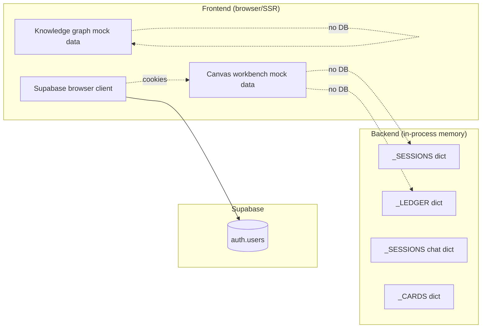

# Status — what's mock, what's done, what's needed

## Quick read

| Layer | Status | Notes |
|---|---|---|
| Frontend shell (Next 16, Tailwind v4, shadcn, Tailark blocks, dark mode) | ✅ | [`frontend/app/layout.tsx`](../frontend/app/layout.tsx), [`components/blocks/`](../frontend/components/blocks) |
| Supabase Auth (signup/login/logout/email confirm) | ✅ | [`frontend/lib/supabase/`](../frontend/lib/supabase), [`frontend/proxy.ts`](../frontend/proxy.ts) |
| Per-user data scoping (everything is global right now) | 🔴 | No `user_id` columns yet. See [feature-auth.md](feature-auth.md). |
| Canvas page + React Flow + WebSocket streaming | ✅ | [`components/canvas/canvas-workbench.tsx`](../frontend/components/canvas/canvas-workbench.tsx), [`backend/.../api/routes/ws.py`](../backend/src/canvasai/api/routes/ws.py) |
| LangGraph 4-agent pipeline | ✅ | [`backend/src/canvasai/graph/builder.py`](../backend/src/canvasai/graph/builder.py) |
| LLM provider seam (OpenAI live, stub fallback on error/no key) | ✅ | [`backend/src/canvasai/llm/`](../backend/src/canvasai/llm/) |
| Canvas sessions persistence | 🟡 | In-memory dict in [`backend/.../storage/sessions.py`](../backend/src/canvasai/storage/sessions.py). Lost on restart. |
| Time machine (revert to turn N) | 🟡 | Works against the in-memory ledger only. |
| Deck replay (frontend) | ✅ | Lives in `canvas-workbench.tsx`. |
| Active recall: SM-2 algorithm | ✅ | Real SM-2 in [`storage/active_recall.py:review()`](../backend/src/canvasai/storage/active_recall.py). |
| Active recall: card generation from session | 🟡 | LLM-driven with deterministic fallback; cards stored in memory. |
| Active recall: per-session grouping | ✅ | [`/active-recall/sessions`](../backend/src/canvasai/api/routes/active_recall.py). |
| Chat sessions + messages | 🟡 | Routes work, storage in-memory. |
| Documents upload | 🔴 | Endpoint exists; storage returns `{stored: false}`. No bucket, no chunking, no embeddings. |
| Document RAG (Agent 0) | 🔴 | Returns `[]`. |
| Knowledge graph `GET /knowledge-graph/current` | 🔴 | Frontend uses [`mock-knowledge-graph.ts`](../frontend/lib/mock-knowledge-graph.ts) fallback. |
| Knowledge graph `POST /knowledge-graph/from-session/{id}` | 🔴 | Frontend calls it; backend route missing → toast informs user. |
| Inngest workflows | 🟡 | Client + one no-op `ping` registered. Not mounted. No real jobs. |
| New-session "+" flow on dashboard + sidebar | ✅ | [`components/dashboard/new-session-dialog.tsx`](../frontend/components/dashboard/new-session-dialog.tsx). Calls `POST /sessions`; falls back to a local id if the backend is offline. |

## Database — what is in Supabase right now

**Only `auth.users`.** Supabase manages it; no rows are written by our code beyond signup.

We have **zero application tables**. Everything else is a Python `dict` that dies with the process. See per-feature docs for the proposed schema.

## What "use mock data everywhere" means today

The user OK'd this for the v1 demo. So the working setup is:

1. Frontend ships with [`lib/mock-data.ts`](../frontend/lib/mock-data.ts) and [`lib/mock-knowledge-graph.ts`](../frontend/lib/mock-knowledge-graph.ts) for first-load content.
2. Pages call the backend ([`lib/canvasai-api.ts`](../frontend/lib/canvasai-api.ts)). When the call succeeds, real backend state replaces the mock. When it fails, the mock stays visible. No errors are thrown at the user.
3. The backend's "real" responses come from in-memory dicts, **not Supabase**. So a uvicorn restart wipes everything.
4. The "+" New-session flow goes through `POST /sessions` to make the new id discoverable via `GET /sessions`. It falls back to a local-only id if the backend is offline (no in-process listing, but the canvas page still renders via `getCanvasSession`'s id-as-topic fallback in [mock-data.ts:250-265](../frontend/lib/mock-data.ts#L250-L265)).

## Known broken / fragile things

| Thing | Symptom | Fix |
|---|---|---|
| Knowledge graph export from canvas | Toast: "endpoint is not wired yet" | Add `POST /knowledge-graph/from-session/{id}` to backend. See [feature-knowledge-graph.md](feature-knowledge-graph.md). |
| Document upload | Files accepted but never stored | Implement Supabase Storage upload + chunking + pgvector. See [feature-documents.md](feature-documents.md). |
| Run-turn used to crash with 401 from OpenAI | Fixed — provider now logs + falls back to deterministic stub. | If you see this again, check `OPENAI_API_KEY` validity. |
| Backend restarts wipe all sessions/cards/chats | Expected — in-memory only | Persist (see per-feature DB plan). |
| Anyone signed in sees the same data | No user scoping | Add `user_id` everywhere; pass JWT from frontend. See [feature-auth.md](feature-auth.md). |
